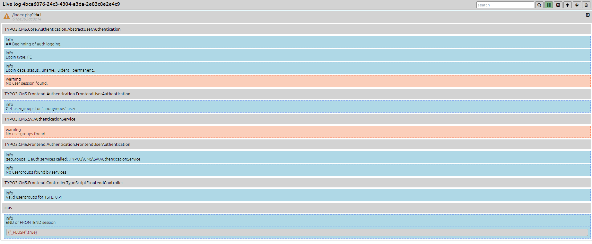

# PHP Livelog 

## What it does

This small tool should simplify the developer's life by offering the possibility to 
follow the logs of a web application live. 

You don't have to `tail` and `grep` the logfiles direct on the machine or to download it. 
The logs will only be written for the current session, so you see only the log of your own requests.

## Install 

The suggested install-method is to use composer `composer req aseemann/php-livelog`. 
After installing the package you have to set a symlink to the web folder in your public 
directory e.g. `ln -s vendor/aseemann/php-livelog/web docroot/livelog`

Now you can open the log dashboard in your webbrowser under the path of the symlinks. 
e.g `domian.tld/livelog`

For easier setup you can add this to your composer.json file in the scripts section.

````json
{
    "scripts": {
        "set-symlinks": [
            "ln -sfT ../vendor/aseemann/php-livelog/web docroot/livelog"
        ],
        "post-install-cmd": [
            "@set-symlinks"
        ],
        "post-update-cmd": [
            "@set-symlinks"
        ]
    }
}
````
## How to use

To send logs to the log page integrate the logger into your scripts as described below. 

````php

$logger = new \ASeemann\PhpLiveLog\Logger('Application Name', 'LoggerName');

$logger->info('A small info massage');

$logger->notice('Some notice', ['data' => 'data for notice']);
````

Afterward the logs should appear on the logging page grouped by the request. 



## Connectors 

For the easy integration in some projects there are also connectors available. So you only
have to add some configuration in your application and all logs of your app will appear 
on the logging page. 

### TYPO3 

Add the following lines to your AdditionalConfiguration.php

````php

$GLOBALS['TYPO3_CONF_VARS']['FE']['debug'] = true;
$GLOBALS['TYPO3_CONF_VARS']['BE']['debug'] = true;
$GLOBALS['TYPO3_CONF_VARS']['SYS']['enable_DLOG'] = true,
$GLOBALS['TYPO3_CONF_VARS']['SYS']['enable_errorDLOG'] = true,
$GLOBALS['TYPO3_CONF_VARS']['SYS']['enable_exceptionDLOG'] = true,
$GLOBALS['TYPO3_CONF_VARS']['SYS']['systemLogLevel'] = 0,

if (false === is_array($GLOBALS['TYPO3_CONF_VARS']['LOG']['writerConfiguration'][\TYPO3\CMS\Core\Log\LogLevel::DEBUG])) {
    $GLOBALS['TYPO3_CONF_VARS']['LOG']['writerConfiguration'][\TYPO3\CMS\Core\Log\LogLevel::DEBUG] = [];
}

$GLOBALS['TYPO3_CONF_VARS']['LOG']['writerConfiguration'][\TYPO3\CMS\Core\Log\LogLevel::DEBUG]
[\ASeemann\PhpLiveLog\Connector\TYPO3\LogWriter::class] = [
];

$GLOBALS['TYPO3_CONF_VARS']['SC_OPTIONS']['t3lib/class.t3lib_div.php']['devLog'] = [];
$GLOBALS['TYPO3_CONF_VARS']['SC_OPTIONS']['t3lib/class.t3lib_div.php']['devLog'][]
    = \ASeemann\PhpLiveLog\Connector\TYPO3\DevLogger::class . "->devLogger";
````

The lines you take from here may vary depending on you typo3 installation.

You have also the possibility to exclude some loggers. So you can keep the focus on what you
want to see. To exclude the logger pass the option `ignorePattern` to the log-writer. 

Example: (Ignore all logger wich contains Frontend in their names )
````php
$GLOBALS['TYPO3_CONF_VARS']['LOG']['writerConfiguration'][\TYPO3\CMS\Core\Log\LogLevel::DEBUG]
[\ASeemann\PhpLiveLog\Connector\TYPO3\LogWriter::class] = [
    'ignorePattern' => '.*Frontend.*'
];
````

## Todos 

* Add formatter for context
* escape tags in context
* Add more connectors.
